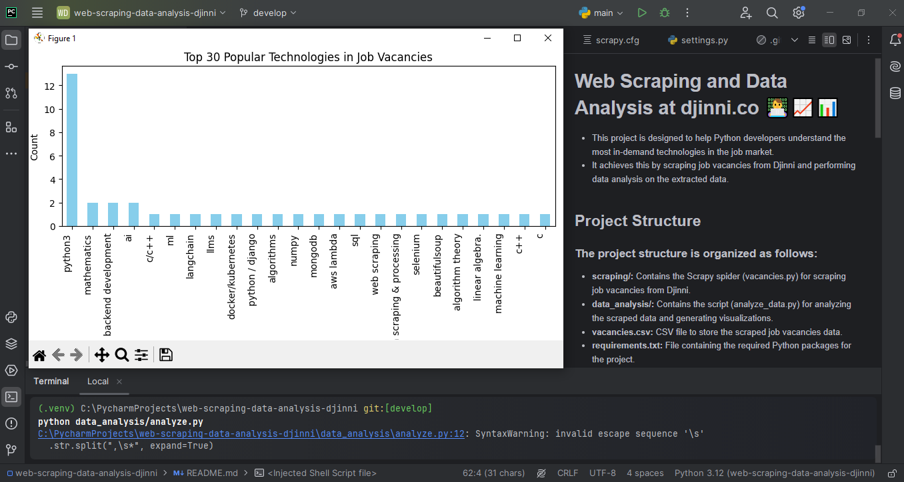
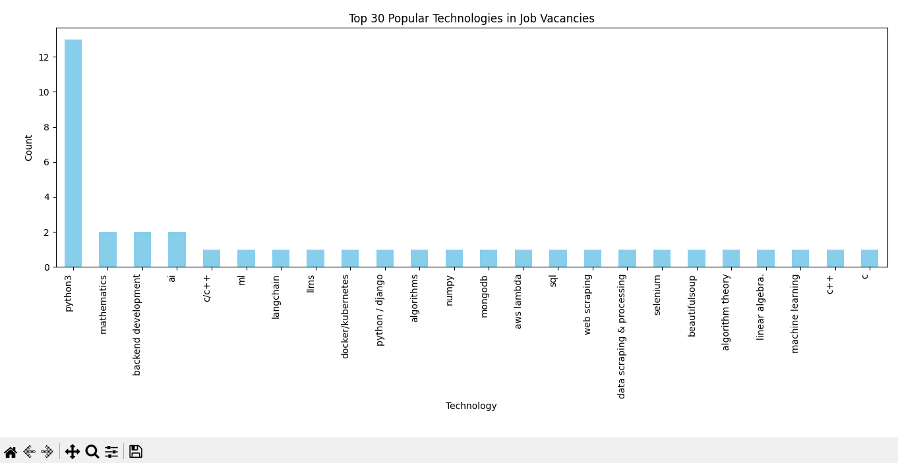
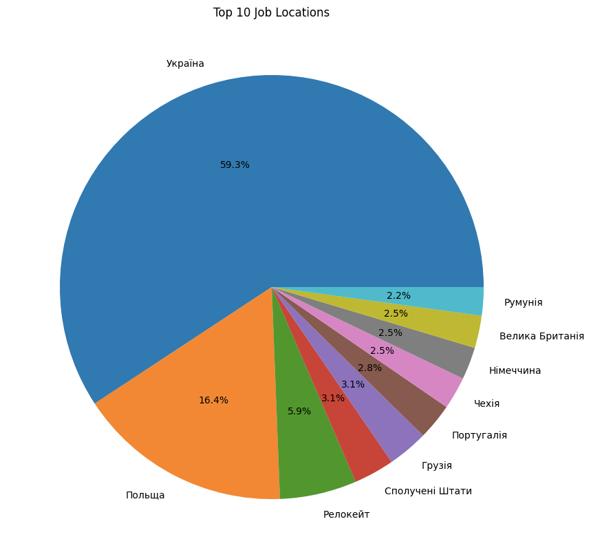
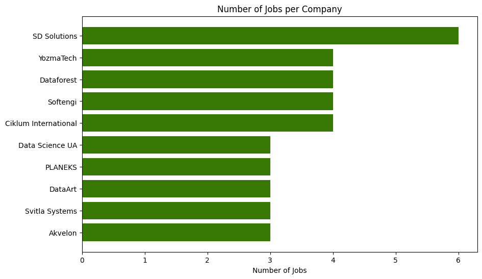
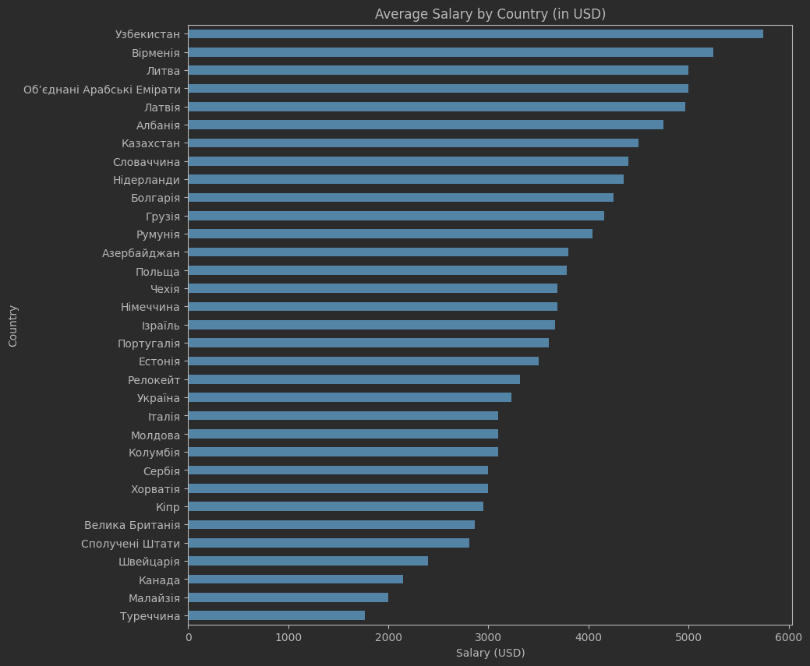

<h1>Web Scraping and Data Analysis at djinni.co 👨‍💻📈📊</h1>

<ul>
   <li>This project is designed to help Python developers understand the most in-demand technologies in the job market.</li>
   <li>It achieves this by scraping job vacancies from Djinni and performing data analysis on the extracted data.</li>
</ul>

### 🏞 Project Image:


## Project Structure:
* **djinni_scrapper:** Contains the Scrapy spider (vacancies.py) for scraping job vacancies from Djinni.
* **data_analysis:** Contains the script (analyze_data.py) for analyzing the scraped data and generating visualizations.
* **vacancies.csv:** CSV file to store the scraped job vacancies data.
* **requirements.txt:** File containing the required Python packages for the project.

### 🏞 Top 30 Technologies:


### Scraping:
- The scraping section uses Scrapy to crawl Djinni for Python-related job listings.
- The spider (vacancies.py) follows links to job postings, extracting details like job titles and required technologies.

### Data Analysis:
- The data analysis uses pandas and matplotlib to analyze scraped data.
- The script (analyze_data.py) reads vacancies.csv, cleans data, counts technology occurrences, and generates a bar chart of the top 30 popular job vacancy technologies.

### Results:
- After running the data analysis script, you will see a bar chart titled "Top 30 Popular Technologies in Job Vacancies".
- This chart shows the count of each technology mentioned in the job listings.

### 🏞 Top 10 Job Locations:


## Installation:
<ul>
    <li><strong>Install Python 3.10.</strong></li>
    <li><strong>Clone the repository.</strong></li>
    <li><strong>Run the application.</strong></li>
    <li><strong>Feel free to explore and contribute!</strong></li>
</ul>

```shell
git clone https://github.com/ArtemLeo/web-scraping-data-analysis-djinni.co.git

(for Windows)
python -m venv venv
source venv/Scripts/activate

(for Mac/Linux)
python3 -m venv venv
source venv/bin/activate

python -m pip install --upgrade pip
pip install -r requirements.txt

```

### 🏞 Number of Jobs per Company:


## Usage:
```shell
▪️ Run the scraping spider to gather job vacancies from Djinni.
▪️ This command will scrape job vacancies and save the data to a CSV file named vacancies.csv:
👉 'scrapy crawl vacancies -o vacancies.csv'

▪️ Run the data analysis script to analyze the scraped data.
▪️ This command reads data from vacancies.csv, analyzes it, and generates a bar chart displaying the top 10 popular technologies in job vacancies.
👉 'python data_analysis/analyze.py'

```
### 🏞 Average Salary by Country (in USD):


## Contributing 👨‍💻🤝💪:
- Contributions to improve the project are welcome, including suggestions, bug reports, and feature requests.
- Feel free to open an issue or submit a pull request for any contributions you'd like to make.